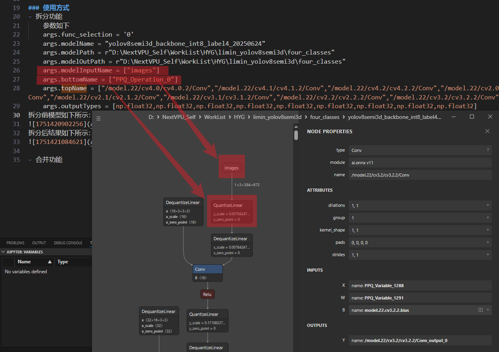
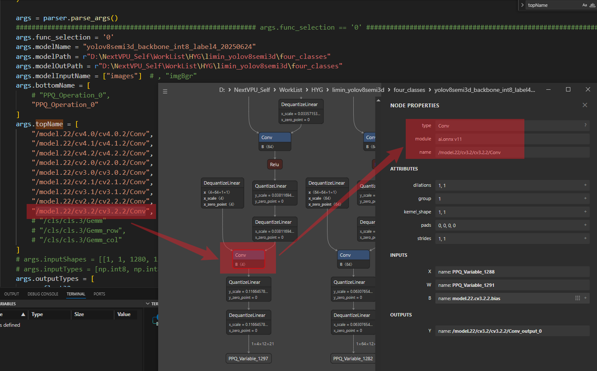
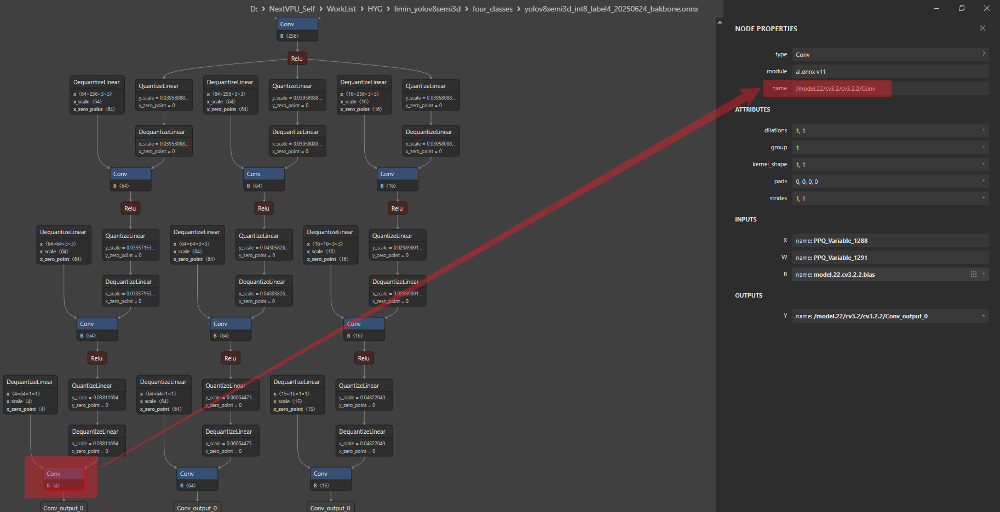
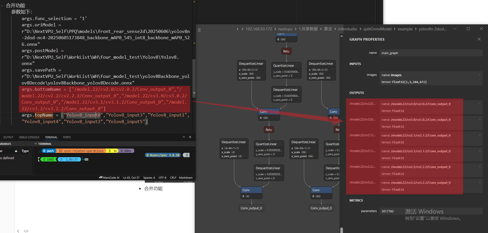
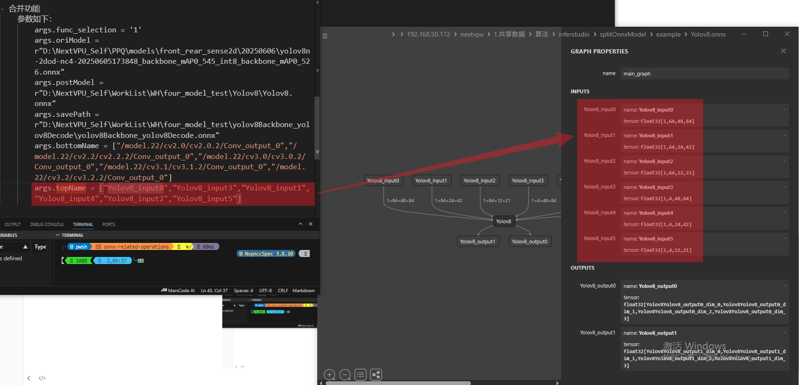

### 参数解析
- --func_selection：功能选择，目前支持的功能有：
    - 0：模型拆分
    - 1：模型合并
- --modelPath：存放待拆分模型的路径
- --modelName：待拆分模型的名称
- --modelInputName：待拆分部分输入名称，有多个则以','分割，input1,input2,input3
- --bottomName：待拆分或合并部分起始节点名称，有多个则以','分割，node1,node2,node3
- --topName：待拆分或合并部分终止节点名称，有多个则以','分割，node1,node2,node3
- --inputShapes：待拆分部分输入shape，有多个则以';'分割，1,3,1024,1248;1,3,1024,1248;1,3,1024,1248
- --inputTypes：待拆分部分输入type，有多个则以','分割，float32,float32,int8
- --outputShapes：待拆分部分输出shape，有多个则以';'分割，1,3,1024,1248;1,3,1024,1248;1,3,1024,1248
- --outputTypes：待拆分部分输出type，有多个则以','分割，float32,float32,int8
- --savePath：输出模型文件地址
- --oriModel：原始模型路径
- --postModel：需要合并的后处理模型路径

### 使用方式
- 拆分功能  
    参数如下  
      args.func_selection = '0'  
      args.modelName = "yolov8semi3d_backbone_int8_label4_20250624"  
      args.modelPath = r"D:\NextVPU_Self\WorkList\HYG\limin_yolov8semi3d\four_classes" 
      args.modelOutPath = r"D:\NextVPU_Self\WorkList\HYG\limin_yolov8semi3d\four_classes" 
      args.modelInputName = ["images"] 
      args.bottomName = ["PPQ_Operation_0"] 
      args.topName = ["/model.22/cv4.0/cv4.0.2/Conv","/model.22/cv4.1/cv4.1.2/Conv","/model.22/cv4.2/cv4.2.2/Conv","/model.22/cv2.0/cv2.0.2/Conv","/model.22/cv3.0/cv3.0.2/Conv","/model.22/cv2.1/cv2.1.2/Conv","/model.22/cv3.1/cv3.1.2/Conv","/model.22/cv2.2/cv2.2.2/Conv","/model.22/cv3.2/cv3.2.2/Conv"] 
      args.outputTypes = [np.float32,np.float32,np.float32,np.float32,np.float32,np.float32,np.float32,np.float32,np.float32] 
      拆分前模型如下所示： 
    
    
      拆分后结果如下所示： 
    

- 合并功能  
    参数如下：  
      args.func_selection = '1' 
      args.oriModel = r"D:\NextVPU_Self\PPQ\models\front_rear_sense2d\20250606\yolov8n-2dod-nc4-20250605173848_backbone_mAP0_545_int8_backbone_mAP0_526.onnx" 
      args.postModel = r"D:\NextVPU_Self\WorkList\WH\four_model_test\Yolov8\Yolov8.onnx" 
       args.savePath = r"D:\NextVPU_Self\WorkList\WH\four_model_test\yolov8Backbone_yolov8Decode\yolov8Backbone_yolov8Decode.onnx" 
      args.bottomName = ["/model.22/cv2.0/cv2.0.2/Conv_output_0","/model.22/cv2.2/cv2.2.2/Conv_output_0","/model.22/cv3.0/cv3.0.2/Conv_output_0","/model.22/cv3.1/cv3.1.2/Conv_output_0","/model.22/cv3.2/cv3.2.2/Conv_output_0"] 
       args.topName = ["Yolov8_input0","Yolov8_input3","Yolov8_input1","Yolov8_input4","Yolov8_input2","Yolov8_input5"] 
      原始模型输出节点: 
    
      需要合并模型的输入节点： 
    